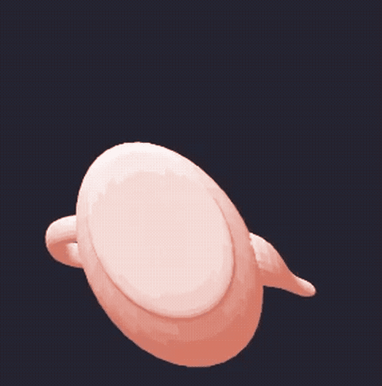

# Baby's First Graphics Engine

This was my first Rust project!

## What is this?
This is a Rust port of [javidx9's excellent C++ graphics engine tutorial](https://www.youtube.com/watch?v=ih20l3pJoeU&t=1659s). 
It still has some kinks and I haven't added textures yet but can take an .obj file, render it, rotate it, and move a camera around it (or rather, move it around the camera....). 

## Where can I read more?
I made a whole writeup over at my [blog](https://www.jamesgisele.com/blog/software_renderer/#wasm-example). As a bonus - if you get to the end you get a WASM-powered Kate Bush Cube Visuzalizer with Interactive Perspective Camera for your troubles.
